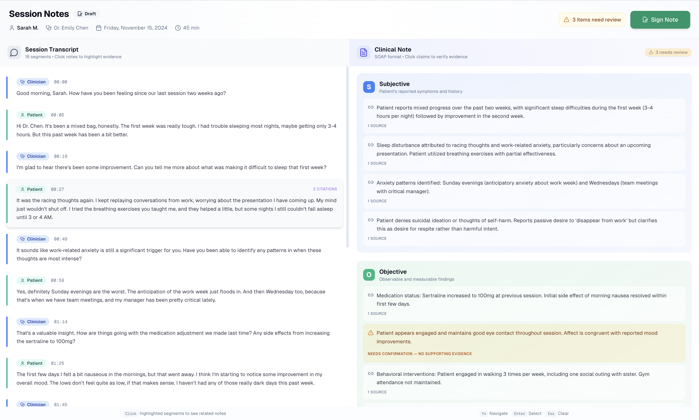

# AidMi Evidence-Backed Session Notes

A full-stack implementation of AidMi's Session Detail view, demonstrating the core interaction of viewing clinical notes alongside source transcripts with clickable citations.



## 🎯 Overview

This project implements an evidence-backed clinical documentation interface where:

- **Every claim links to evidence**: Each statement in the AI-generated note is connected to specific transcript moments
- **Trust through transparency**: Clinicians can verify AI-generated documentation by seeing exactly where each claim comes from
- **Visual flagging**: Claims without supporting evidence are clearly marked for review

## ✨ Features

### Must-Have (Completed)

- ✅ **Tech Stack**: Next.js 14 (App Router), TypeScript, Tailwind CSS, Radix UI
- ✅ **Split-View Layout**: Transcript on left, Notes on right (responsive)
- ✅ **Citation Interaction**: Click note spans → highlight transcript segments with smooth scroll
- ✅ **Visual Flagging**: Distinguish supported claims vs "Needs Confirmation"
- ✅ **Timestamp Display**: Format as MM:SS
- ✅ **Speaker Differentiation**: Visual distinction between Clinician and Patient
- ✅ **SOAP Sections**: Organized under Subjective, Objective, Assessment, Plan headers

### Bonus Features (Completed)

- ✅ **Edit Mode**: Inline editing with save/cancel, keyboard shortcuts (⌘+Enter to save)
- ✅ **Bidirectional Linking**: Click transcript segments → see which notes cite them
- ✅ **Sign Note Flow**: Confirmation modal with warning about unverified claims
- ✅ **Persist to Database**: Prisma + SQLite with full CRUD operations
- ✅ **Keyboard Navigation**: ↑↓ to navigate, Enter to select, Esc to clear
- ✅ **Accessibility**: ARIA labels, focus management, semantic markup

## 🛠 Tech Stack

| Technology | Purpose |
|------------|---------|
| **Next.js 14** | App Router for server components & API routes |
| **TypeScript** | Type safety throughout |
| **Tailwind CSS** | Utility-first styling |
| **Radix UI** | Accessible component primitives |
| **Framer Motion** | Smooth animations |
| **Prisma** | Database ORM |
| **SQLite** | Local database (easy setup) |

## 🚀 Quick Start

### Prerequisites

- Node.js 18+
- npm or yarn

### Setup

```bash
# 1. Install dependencies
npm install

# 2. Set up the database
npm run db:push

# 3. Seed with sample data
npm run db:seed

# 4. Start development server
npm run dev
```

Open [http://localhost:3000](http://localhost:3000) to view the application.

## 📁 Project Structure

```
src/
├── app/
│   ├── api/
│   │   └── sessions/
│   │       ├── [sessionId]/
│   │       │   ├── route.ts        # GET session
│   │       │   └── sign/route.ts   # POST sign note
│   │       └── note-spans/
│   │           └── [noteSpanId]/
│   │               └── route.ts    # PATCH edit note span
│   ├── globals.css                 # Global styles & CSS variables
│   ├── layout.tsx                  # Root layout with fonts
│   └── page.tsx                    # Main page (server component)
├── components/
│   ├── session/
│   │   ├── SessionDetail.tsx       # Main orchestrating component
│   │   ├── SessionHeader.tsx       # Header with sign note button
│   │   ├── TranscriptPanel.tsx     # Left panel - transcript view
│   │   └── NotePanel.tsx           # Right panel - SOAP notes
│   └── ui/                         # Reusable UI components
│       ├── alert-dialog.tsx
│       ├── badge.tsx
│       ├── button.tsx
│       ├── scroll-area.tsx
│       ├── separator.tsx
│       └── tooltip.tsx
├── hooks/
│   └── useSessionState.ts          # State management for citations
├── lib/
│   ├── prisma.ts                   # Database client singleton
│   └── utils.ts                    # Utility functions
└── types/
    └── index.ts                    # TypeScript type definitions
```

## 🎨 Design Decisions

### 1. Citation Linking Architecture

I chose a **bidirectional mapping** approach:

```typescript
// Note span → Transcript (primary direction)
citations: string[] // Array of transcript segment IDs

// Transcript → Note spans (computed, reverse lookup)
transcriptToCitations: Map<string, Set<string>>
```

This allows both:
- Clicking a note to see its evidence
- Clicking transcript to see which notes reference it

### 2. State Management

Used a custom hook (`useSessionState`) for:
- Centralized state logic
- Clean separation from UI components
- Easy testing potential
- Memoized reverse citation map

### 3. Visual Hierarchy

- **Color coding**: Blue for clinician, teal for patient, purple for citations, amber for warnings
- **SOAP sections**: Distinct gradient backgrounds for easy scanning
- **Progressive disclosure**: Citation counts only shown on hover/selection

### 4. Responsive Design

- Desktop: Side-by-side split view
- Mobile: Stacked panels (transcript above notes)
- Touch-friendly tap targets

## 🔮 Future Improvements

With more time, I would:

1. **Search & Filter**: Add transcript search and note filtering by section
2. **Audio Playback**: Play audio from specific timestamps
3. **Version History**: Track edits with diff view
4. **Multi-session Support**: Session list view with navigation
5. **Real-time Collaboration**: Live cursors for team review
6. **Export Options**: PDF, DOCX export of signed notes
7. **Dark Mode**: Complete dark theme support
8. **Test Coverage**: Unit and integration tests with React Testing Library
9. **Performance**: Virtual scrolling for long transcripts

## 🤖 AI Tool Usage

I used Claude (Anthropic) as a development assistant for:

- **Architecture decisions**: Discussed tradeoffs between state management approaches
- **Boilerplate generation**: Component scaffolding and type definitions
- **CSS refinement**: Tailwind class combinations and animation timing
- **Code review**: Catching edge cases and accessibility issues

**Key learning**: AI is most effective as a collaborative partner when you have clear requirements and can evaluate suggestions critically. I still made all architecture decisions and reviewed all generated code for correctness.

## 📊 Sample Data

The seed data includes a realistic 45-minute behavioral health session with:

- **16 transcript segments**: Mix of clinician questions and patient responses
- **15 note spans**: Full SOAP documentation
- **3 "needs confirmation" items**: Claims without supporting evidence
- **Multiple citations per span**: Demonstrating evidence linking

## 📝 License

MIT License - Built for AidMi take-home assessment.

---

**Questions?** Feel free to reach out for clarification on any implementation decisions.
